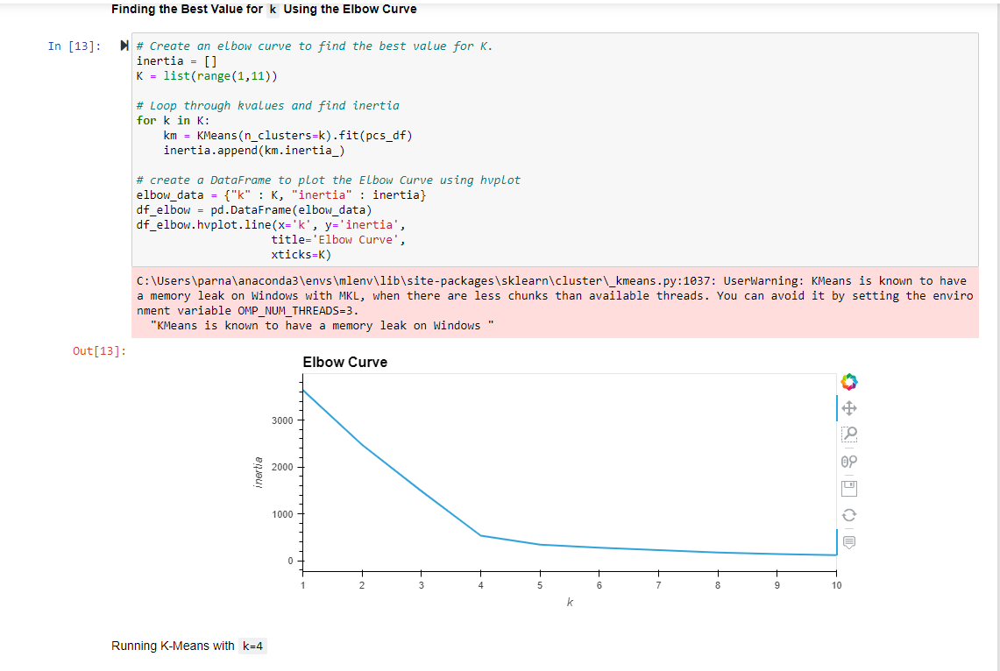
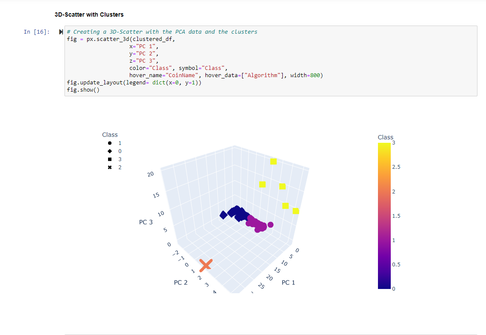
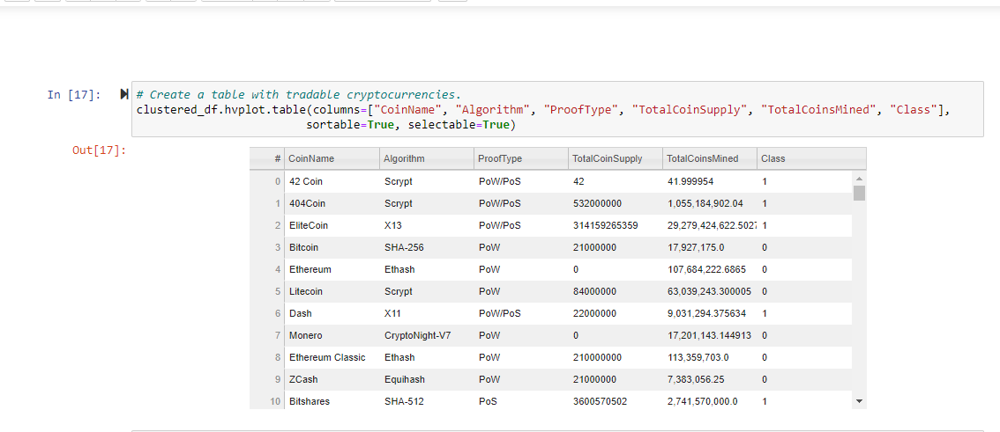
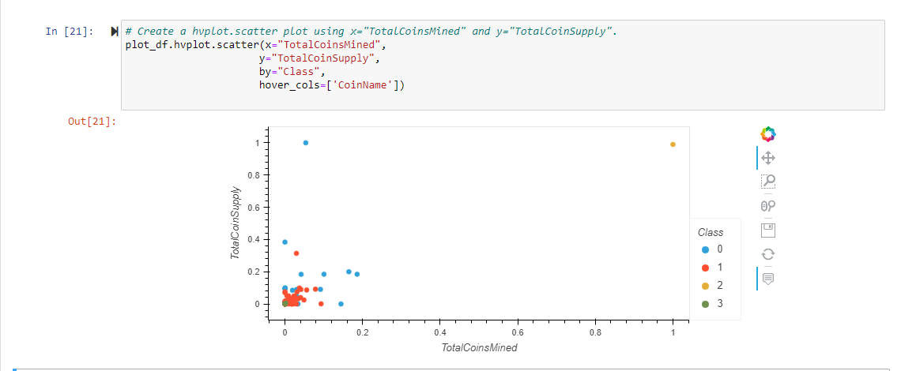

# Cryptocurrencies

## Purpose

Accountability Accounting, a prominent investment bank, is interested in offering a new cryptocurrency investment portfolio for its customers.

The purpose of this project is to create a report that includes which cryptocurrencies are on the trading market and how they could be grouped to create a classification system for this new investment.

The data is not ideal, so it will need to be processed to fit the machine learning models. Since there is no known output, unsupervised learning models are to be used. To group the cryptocurrencies, clustering algorithm is used. Finally, the findings are to be shared with the board using data visualizations.

## Results

This assignment consists of four technical analysis parts:

1. Preprocessing the Data for PCA - remove null values and unnecessary columns, convert columns with string values to numeric so they can be used by the ML model, standardize the features.

2. Reducing Data Dimensions Using PCA - reduce the features to three primary components.

3. Clustering Cryptocurrencies Using K-means - create an elbow curve using 'hvplot' to find the best value for 'K'. Then run the K-Means algorithm to predict the K clusters for the cryptocurrencies.

4. Visualizing Cryptocurrencies Results - create a scatter plots with Plotly Express and hvplot, to visualize the distinct groups that correspond to the three principal components. 

Then create a table with all the currently tradable cryptocurrencies using the hvplot.table() function. 

Using the MinMaxScaler() method, scale the "TotalCoinSupply" and "TotalCoinsMined" columns. Then create a scatter plot to show the relationship between the "TotalCoinSupply" and "TotalCoinsMined" columns. 

